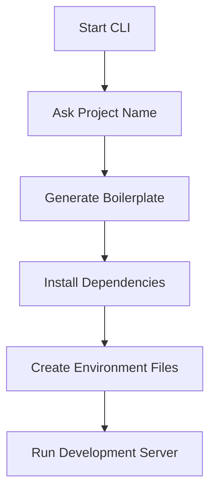

# 🚀 MVCTYPENODE CLI — Project Generator CLI by Er Ravi


### ⚡ Powerful Node.js Backend Project Generator CLI

Generate scalable backend applications instantly with Express, TypeScript, MongoDB, Authentication, MVC architecture, middleware, and reusable boilerplates.

---

# 📌 Introduction

**MVCTYPENODE CLI** is a modern Node.js CLI tool that helps developers generate production-ready backend projects in seconds.

Instead of manually creating folders, installing packages, writing boilerplate code, and configuring TypeScript — MVCTYPENODE CLI automates everything.

Perfect for:

- 🚀 Backend Developers
- ⚡ MERN Stack Developers
- 🛠️ API Development
- 📦 Rapid Prototyping
- 🏢 Startup Projects
- 🎯 Learning Backend Architecture

---

# ✨ Features

## ⚡ Project Generation

- Express.js Setup
- TypeScript Configuration
- MVC Folder Structure
- Environment Variables
- Clean Architecture

## 🔐 Authentication Module

Generate:

- Controller
- Model
- Routes
- Middleware

## 📦 Automatic Installation

Automatically installs:

- express
- mongoose
- dotenv
- cors
- nodemon
- ts-node
- typescript

## 🎨 Beautiful CLI

Built using:

- Chalk
- Inquirer

## 🛠️ Developer Friendly

- Reusable templates
- Scalable structure
- Clean code generation
- Auto server start
- Easy customization

---

# 🖼️ Preview

## CLI Startup

```bash
$ mvctypenode create my-api
$ auto steup
```

---

## Interactive Questions

```bash
? Enter Project Name: my-api
? Install Dependencies? Yes
? Start Development Server? Yes
```

---

## Success Output

```bash
✔ Project Created Successfully
✔ Dependencies Installed
✔ MongoDB Configured
✔ Server Running on PORT 4000
```

---

# 📂 Generated Project Structure

```bash
my-api/
│
├── src/
│   │
│   ├── controllers/
│   │   └── auth.controller.ts
│   │
│   ├── models/
│   │   └── auth.model.ts
│   │
│   ├── routes/
│   │   └── auth.route.ts
│   │
│   ├── middleware/
│   │   └── auth.middleware.ts
│   │
│   ├── app.ts
├── .env
├── .gitignore
├── package.json
├── tsconfig.json
└── README.md
```

---

# ⚙️ Installation

## Install Globally

```bash
npm install -g mvctypenode
```

---

# 🚀 Commands

## Create New Project(auto)

```bash
mvctypenode create my-app
```

---

## Generate Authentication Module

```bash
mvctypenode generate auth
```

---

## Generate User Module

```bash
mvctypenode generate user
```

---

## Start Development Server(auto run)

```bash
npm run dev
```

---

# 🔥 Generated Express Boilerplate

## main.ts

```ts
import express from "express";
import dotenv from "dotenv";
import mongoose from "mongoose";

dotenv.config();

const app = express();

app.use(express.json());

mongoose
  .connect(process.env.DB!)
  .then(() => console.log("MongoDB Connected"))
  .catch(() => console.log("MongoDB Connection Failed"));

app.get("/", (_, res) => {
  res.send("Server Running 🚀");
});

const PORT = process.env.PORT || 5000;

app.listen(PORT, () => {
  console.log(`Server running on PORT ${PORT}`);
});
```

---

# 📄 Example .env

```env
PORT=4000
DB=mongodb://localhost:27017/mydb
```

---

# 📦 Installed Dependencies

## Production Dependencies(auto install)

```bash
npm install express mongoose dotenv cors
```

---

## Development Dependencies(auto install)

```bash
npm install -D typescript ts-node nodemon @types/node @types/express
```

---

# 🧠 CLI Workflow



---

# 🛠️ Tech Stack

| Technology | Usage               |
| ---------- | ------------------- |
| Node.js    | Runtime             |
| TypeScript | Language            |
| Express.js | Backend Framework   |
| MongoDB    | Database            |
| Chalk      | CLI Styling         |
| Inquirer   | Interactive Prompts |

---

# 📘 Example Usage

## Create Project

```bash
mvctypenode create ecommerce-api
```

---

## Generate Auth Module

```bash
mvctypenode generate auth
```

Generated Files:

```bash
auth.controller.ts
auth.model.ts
auth.route.ts
auth.middleware.ts
```

---

# 🤝 Contributing

Contributions are welcome ❤️

## Fork Repository

```bash
git clone https://github.com/Rktechpro/mvctypenode-npm.git
```

---

## Install Packages(auto install)

```bash
npm install
```

---

## Run Development(auto run)

```bash
npm run dev
```

---

# 🐛 Issues

If you find any bug or want to request a feature:

- Create an Issue
- Submit a Pull Request

---

# 📜 License

MIT License

Copyright (c) 2026 Ravi Kumar

Permission is hereby granted, free of charge, to any person obtaining a copy of this software and associated documentation files.

---

# 👨‍💻 Author

## Er Ravi

### 🚀 Full Stack Developer

### MERN Stack Developer

### Backend Engineer

---

# 🌐 Connect With Me

- GitHub
- LinkedIn
- Twitter
- Portfolio

---

# ⭐ Support

If you like this project:

```bash
⭐ Star the Repository
🍴 Fork the Project
📢 Share with Developers
💖 Support Open Source
```

---

# 🚀 RNode CLI

### Made with ❤️ by Er Ravi
